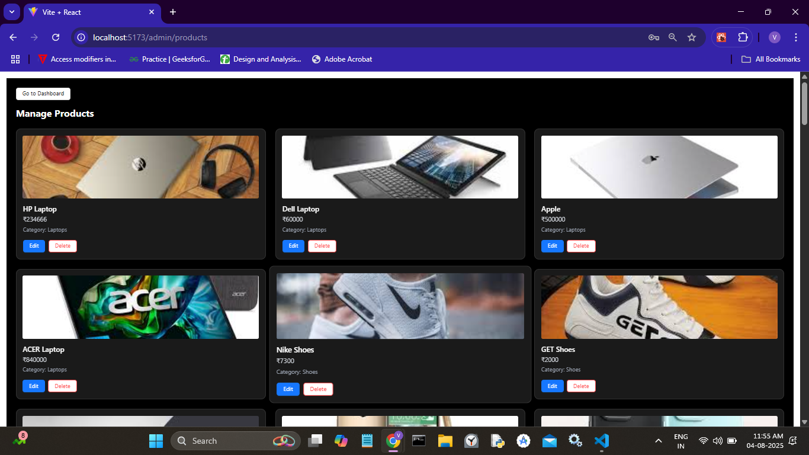

<<<<<<< HEAD
# VougeMart
Mern Web app
=======


## 📄 **E-Commerce Website Project Report**


---

### 1. 📝 Introduction

This project is a full-stack e-commerce web application built using the **MERN Stack (MongoDB, Express.js, React.js, Node.js)**. The objective is to build a responsive, user-friendly online store that supports user registration, product browsing, cart management, order processing, and an admin dashboard for managing the system.

The application allows users to:

* Register/Login
* Browse products
* Add items to cart and place orders
* View and manage their orders

Admins can:

* Add/edit/delete products
* View all orders
* Mark orders as delivered

---

### 2. 📁 Project Structure

```
.
├── backend/
│   ├── controllers/
│   ├── models/
│   ├── routes/
│   ├── middleware/
│   ├── config/
│   └── server.js
├── frontend/
│   ├── src/
│   │   ├── components/
│   │   ├── pages/
│   │   ├── services/
│   │   ├── App.jsx
│   │   └── main.jsx
├── .env
├── package.json
└── README.md
```

* **backend/**: Handles API routes, business logic, database interaction.
* **frontend/**: React app for UI using Tailwind CSS and Ant Design.

---

### 3. 🧰 Technical Stack

* **Frontend:** React.js, Tailwind CSS, Ant Design
* **Backend:** Node.js, Express.js
* **Database:** MongoDB (Mongoose ODM)
* **Authentication:** JWT Token, Cookies
* **State Management:** React Context + LocalStorage
* **Payment (Test):** Dummy PayPal-like implementation
* **Version Control:** Git & GitHub
* **Deployment:** *\[Optional if deployed]*

---

### 4. 🌟 Features and Functionalities

#### 👤 User Features:

* Register, Login, Logout
* Browse Products by Category, Search, Price Filters
* View product details
* Add to Cart (localStorage-based)
* Checkout and place orders
* Mark their orders as paid
* View order history

#### 🛠 Admin Features:

* Admin login
* Add/edit/delete products
* Manage product categories
* View all orders
* Mark orders as delivered

#### 🧾 Order System:

* Orders include user, cart items, total price, payment & delivery status

---

### 6. 🖼️ Screenshots and Visuals

### Home Page


### Home after Login


### Login Page


### Register Page


### Logout Page


### Product Page


### Product Details Page


###  Added to favourites Page


###  Search Bar


### All categories Page


### Category select Page


### Favourite  Page


### Cart Page


### Shipping Page


### Paypal page


### User Orders page


### MArk order as paid 

---
Admin Panel
---
### Admin DashBoard page


### Manage Products page



### ADD PRoduct 


### Add PRoduct Button 


### Paypal page


### Manage categories page


### Add Cateory page


### Edit Cateory page


### Manage users page


### Admin profile page


---

### 7. 🗃 Database Structure

#### 🔹 User Model:

```js
{
  username: String,
  email: String,
  password: String (hashed),
  role: String (user/admin)
}
```

#### 🔹 Product Model:

```js
{
  name: String,
  description: String,
  price: Number,
  category: ObjectId,
  image: String
}
```

#### 🔹 Order Model:

```js
{
  user: ObjectId,
  orderItems: [ { product, quantity } ],
  totalPrice: Number,
  isPaid: Boolean,
  isDelivered: Boolean,
  paymentResult: Object
}
```

#### 🔹 Category Model:

```js
{
  name: String
}

---

### 8. 🚧 Challenges Faced

* Setting up secure authentication with JWT and cookies
* Managing separate user and admin flows
* Maintaining synchronization between localStorage cart and backend
* Creating reusable Ant Design components with Tailwind layout
* Handling role-based access in protected routes

---

### 9. ✅ Conclusion

This project demonstrates a fully functional e-commerce system using the MERN stack. Through this experience, I deepened my understanding of full-stack development, authentication flows, and component-driven UI design. The project also helped in learning how to structure large applications and handle real-world problems like routing, protected pages, and database schema design.

---

>>>>>>> 136545d (First Commit)
